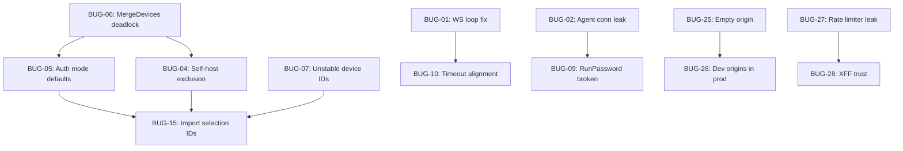

# ShellWave Pre-Alpha Bug Audit

> [!IMPORTANT]
> Every bug below was found by reading every line of every code file. Bugs are grouped by area and ordered by severity. Each fix includes the exact file and approach so fixes don't conflict.

---

## Category 1 — WebSocket / Terminal Session Bugs

### BUG-01: Busy-wait loop in WebSocket handler burns CPU and double-sends `disconnected`

**File:** [main.go](file:///Users/drake/code/web/shellwave/cmd/server/main.go#L133-L158)

The message-read loop uses `select { case <-done: ... default: }` with a blocking `readClientMessage` in the `default` branch. When the session ends (`done` closes), the goroutine sending `StateDisconnected` at line 129 races with line 136 which *also* sends `StateDisconnected`. The client gets the status twice.

Additionally, once `readClientMessage` returns an error (line 142), the loop `break`s out of the `switch`, not the `for`, so it falls through to send a *third* `StateDisconnected` at line 158 after the loop exits.

**Fix:**
- Remove the `select/default` wrapper. Use a separate goroutine for reading client messages and send them through a channel.
- Remove the duplicate `StateDisconnected` write at line 136 — the goroutine at line 129 already handles it.
- Change `break` at line 143 to a labeled break or `return` so the loop actually exits on read error.

```go
// Simplified fix: replace lines 133-158 with:
for {
    msg, err := readClientMessage(conn)
    if err != nil {
        return // socket closed or error; the Wait goroutine handles cleanup
    }
    switch msg.Type {
    case wsproto.ClientTypeInput:
        _, _ = session.Stdin.Write([]byte(msg.Data))
    case wsproto.ClientTypeResize:
        if err := session.Resize(msg.Cols, msg.Rows); err != nil {
            writer.writeJSON(wsproto.Error("resize failed: " + err.Error()))
        }
    case wsproto.ClientTypePing:
        writer.writeJSON(wsproto.Status(wsproto.StateConnected))
    default:
        writer.writeJSON(wsproto.Error("unsupported message type: " + msg.Type))
    }
}
```

---

### BUG-02: SSH agent connection leaks (file descriptor never closed)

**File:** [auth.go](file:///Users/drake/code/web/shellwave/internal/ssh/auth.go#L73-L83)

`agentAuth()` opens a Unix socket `net.Dial("unix", socket)` but never closes it. The `conn` is wrapped in an agent client and returned as an auth method. The underlying socket FD leaks for every SSH connection using agent auth.

**Fix:** Return the `conn` alongside the auth method so callers can close it, or wrap it in a closer that the session lifecycle manages. Simplest immediate fix: store the conn and close it in `Session.Close()`.

---

### BUG-03: Port validation allows port 0 through WebSocket connect

**File:** [protocol.go](file:///Users/drake/code/web/shellwave/internal/ws/protocol.go#L96-L98)

`ValidateConnect` checks `msg.Port < 0 || msg.Port > 65535` but port `0` passes validation. Port 0 is then defaulted to 22 later, but the validation error message says "port must be between 1 and 65535" which is inconsistent — it should reject 0 if the message says 1-65535, or accept 0 explicitly as "use default."

**Fix:** Change to `msg.Port < 0 || msg.Port > 65535` → leave as-is (0 means default), but fix the error message to say "port must be between 0 and 65535 (0 uses the default)".

---

## Category 2 — Tailscale Import / Device Display Bugs

### BUG-04: Self-host is NOT excluded from tailnet import (README says it is)

**File:** [status.go](file:///Users/drake/code/web/shellwave/internal/tailscale/status.go#L96-L110)

README line 29 says: *"The ShellWave host itself is intentionally excluded from the import list."* But `ParseStatus` iterates `raw.Peer` and converts all peers to devices. The `Self` node is stored in `status.Self` but **never filtered out of imports**. If the server running ShellWave is also a tailnet peer, it will appear in the device list and users can SSH into the machine running ShellWave through ShellWave — a security concern.

**Fix:** In `ParseStatus`, compare each peer's ID/IP against `raw.Self` and skip it. Or filter in `prepareTailscaleImportDevices`.

---

### BUG-05: Tailscale devices default to `password` auth instead of `agent` (contradicts PLAN.md)

**Files:**
- [status.go:147](file:///Users/drake/code/web/shellwave/internal/tailscale/status.go#L147) — hardcodes `AuthMode: "password"`
- [store.go:289](file:///Users/drake/code/web/shellwave/internal/store/store.go#L289) — `MergeDevices` defaults to `"password"`
- [api.go:767](file:///Users/drake/code/web/shellwave/internal/httpapi/api.go#L767) — `defaultAuthMode` fallback is `"password"`
- [device.go:54](file:///Users/drake/code/web/shellwave/internal/devices/device.go#L54) — `Normalize` defaults to `"password"`

PLAN.md Phase 4.2 says: *"Imported devices default to auth mode `agent`."* But every layer defaults to `"password"`. The tailscale test also asserts `password` as expected, so the test is wrong too.

**Fix:** Change `toDevice` in status.go to use `AuthMode: "agent"`. Change `MergeDevices` fallback to `"agent"`. Change `Normalize` fallback to `"agent"`. Update the tailscale test assertion.

---

### BUG-06: `MergeDevices` causes deadlock (double mutex lock)

**File:** [store.go](file:///Users/drake/code/web/shellwave/internal/store/store.go#L285-L300)

`MergeDevices` calls `s.GetDevice(item.ID)` at line 291, which acquires `s.mu`. Then it calls `s.UpsertDevice(item)` at line 295, which also acquires `s.mu`. Since `sync.Mutex` is not reentrant in Go, this **deadlocks** on the second call.

**Fix:** Use the `Locked` internal variants (`getDeviceLocked`, `upsertDeviceLocked`) inside `MergeDevices`, and acquire the lock once at the top of the function.

---

### BUG-07: Device IDs use peer metadata — reimporting changes IDs and creates duplicates

**File:** [status.go:139](file:///Users/drake/code/web/shellwave/internal/tailscale/status.go#L139)

`toDevice` generates IDs via `devices.NewID(peer.ID, peer.DNSName, peer.TailscaleIP)`. If Tailscale reassigns the peer ID (e.g., device re-registration) or the DNS name changes, the device ID changes and a reimport creates a duplicate device instead of updating the existing one.

**Fix:** Use a stable identifier — the Tailscale node ID alone (`peer.ID`) — as the canonical ID source, or at minimum match on `TailscaleIP` as a fallback dedup key.

---

## Category 3 — SSH Connection Bugs

### BUG-08: Connecting to the server ShellWave runs on fails (host allowlist blocks it)

**File:** [api.go:281-326](file:///Users/drake/code/web/shellwave/internal/httpapi/api.go#L281-L326)

`CheckHostAllowed` resolves the host to an IP and checks if it's private/loopback/CGNAT. If the ShellWave server has a Tailscale IP (100.x.x.x), CGNAT range `100.64.0.0/10` is allowed. But the Tailscale CGNAT range is actually `100.64.0.0/10`, which covers `100.64.0.0` – `100.127.255.255`. **Tailscale IPs like `100.80.71.61` (from the README) do fall in this range, so this part works.**

However, if the user connects via MagicDNS hostname (e.g., `server.tail.ts.net`), DNS resolution might return the Tailscale IP *or* might fail if the container can't resolve MagicDNS names. The Docker container mounts the Tailscale socket but may not have MagicDNS configured in `/etc/resolv.conf`.

**Fix:** When checking host allowability for tailscale-sourced devices, also accept any host that resolves to a Tailscale CGNAT IP, and ensure MagicDNS hostnames are resolvable inside the container (or fall back to the stored TailscaleIP).

---

### BUG-09: `RunPassword` ignores host key verification entirely

**File:** [runner.go:51-60](file:///Users/drake/code/web/shellwave/internal/ssh/runner.go#L51-L60)

`RunPassword` constructs a `RunConfig` without setting `HostKeyCallback`. Inside `run()`, if `HostKeyCallback == nil` it returns an error — so `RunPassword` **always fails** with "SSH host key callback is required."

`RunPassword` is a convenience function that is broken by design. If anything calls it, it fails.

**Fix:** Either remove `RunPassword` or require a `HostKeyCallback` parameter.

---

### BUG-10: Terminal timeout is 12s but connect timeout banner says 15s

**File:** [main.go:92](file:///Users/drake/code/web/shellwave/cmd/server/main.go#L92) sets `Timeout: 12 * time.Second`
**File:** [Terminal.svelte:76-81](file:///Users/drake/code/web/shellwave/web/src/components/Terminal.svelte#L76-L81) sets client-side timeout to 15000ms

The backend times out SSH connections at 12s, but the frontend shows "timed out" at 15s. The 3s gap means the backend may return an error that the frontend doesn't attribute to a timeout — it shows a generic SSH error instead.

**Fix:** Align both to the same value (e.g., 15s backend, 18s frontend to give buffer).

---

## Category 4 — README / Documentation Bugs

### BUG-11: README says `docker-compose` (v1 syntax) but also says `docker compose` (v2)

**File:** [README.md](file:///Users/drake/code/web/shellwave/README.md#L17-L27)

Line 18: `docker-compose up -d` (v1 hyphenated)
Line 24: `docker compose up -d` (v2 space)

These are two different binaries. Should pick one consistently (v2 is current).

**Fix:** Use `docker compose` everywhere.

---

### BUG-12: README SHELLWAVE_BIND example binds to external IP but CMD binds to `:4000`

The Dockerfile CMD is `./server -addr :4000` which binds to all interfaces. The `docker-compose.yml` port mapping handles the bind address via `${SHELLWAVE_BIND:-127.0.0.1}:4000:4000`. This means the server inside the container listens on all interfaces (`:4000`), but Docker maps the port. If someone uses the Dockerfile directly without Compose, the server is exposed on all interfaces.

**Fix:** Change the Dockerfile CMD default to `-addr 0.0.0.0:4000` (explicit) and document that the Compose port binding is the security boundary, or change to `127.0.0.1:4000` and have Compose set the addr via environment.

---

### BUG-13: README says "Currently working: … command execution" but auth is needed

The README says command execution works, but the Commands tab requires a session password for password-auth devices. There's no documentation about needing to enter the password in the Overview tab's "Session Password" field first. Users will see the Commands tab but commands will fail with auth errors.

**Fix:** Add a note about session passwords to the README troubleshooting section.

---

## Category 5 — Frontend / UI Bugs

### BUG-14: Tailwind CSS v4 `@import "tailwindcss"` may not work with Svelte 4

**File:** [app.css](file:///Users/drake/code/web/shellwave/web/src/app.css#L1)

The CSS uses `@import "tailwindcss"` and `@theme` which is Tailwind CSS v4 syntax. But this requires the Tailwind v4 Vite plugin or PostCSS plugin. The `postcss.config.js` uses `@tailwindcss/postcss` which is the v4 PostCSS plugin, so this should work. However, the `--color-muted-foreground` token used extensively in the Svelte template (e.g., `text-muted-foreground`) is **never defined** in the `@theme` block.

**Fix:** Add `--color-muted-foreground: #888888;` (or similar) to the `@theme` block. Without it, all `text-muted-foreground` classes resolve to nothing.

---

### BUG-15: Import modal device selection state uses `tailscaleStatus.devices` IDs but they don't match stored device IDs

**File:** [App.svelte](file:///Users/drake/code/web/shellwave/web/src/App.svelte#L197-L228)

`initializeImportState` builds `importSelections` keyed by `device.id` from `tailscaleStatus.devices`. The `isImported` function checks if `devices.some(item => item.id === device.id)`. But the IDs in `tailscaleStatus.devices` are generated by `toDevice()` → `devices.NewID(peer.ID, peer.DNSName, peer.TailscaleIP)`, while the stored device IDs were generated at insert time. If the peer data changed between import and status refresh, IDs won't match and already-imported devices won't be flagged as "imported."

**Fix:** This is related to BUG-07. Stabilize the ID generation to use consistent inputs.

---

### BUG-16: `sessionPasswords` is never populated for password-auth devices unless user manually types into the field

**File:** [App.svelte](file:///Users/drake/code/web/shellwave/web/src/App.svelte#L830)

The Session Password input binds to `sessionPasswords[selectedDevice.id]`, but `sessionPasswords` starts as `{}`. For new devices, it's `undefined`. The terminal reads from `terminalPassword(device)` which returns `sessionPasswords[device.id] || ''`. So password-auth terminals always connect with an empty password unless the user explicitly types into the Overview tab's password field *before* opening the terminal.

The "Add Manual Device" flow saves the password at line 289: `sessionPasswords = { ...sessionPasswords, [device.id]: newDevice.password }`, and then switches to the terminal tab. This works for new devices. But for **imported tailnet devices**, there's no password entry point before terminal — the user must know to go to Overview first.

**Fix:** Show a password prompt when switching to the Terminal tab if `authMode === 'password'` and no session password is set.

---

### BUG-17: Overview tab GET request loads stale overview without probing

**File:** [App.svelte:261-270](file:///Users/drake/code/web/shellwave/web/src/App.svelte#L261-L270)

`loadOverview(id)` does a GET to `/api/devices/{id}/overview`. The API handler returns device metadata from the database — **not** a live probe. The overview shows static data (device.Name, host, OS, source, online, lastSeen) but all the probe fields (hostname, kernel, disk, memory, uptime, load, docker, ports) remain "Unknown" until the user manually clicks "Refresh Overview" which triggers a POST probe.

**Fix:** Either auto-probe on first view, or make it clearly obvious that the overview shows stored metadata only and the user needs to probe.

---

### BUG-18: Device online status is always stale (never updated after initial import)

**File:** [device.go](file:///Users/drake/code/web/shellwave/internal/devices/device.go), [api.go](file:///Users/drake/code/web/shellwave/internal/httpapi/api.go)

When devices are imported from Tailscale, `online` is set based on the Tailscale status at import time. After that, the `online` field is never updated. It's stored in SQLite and returned as-is forever. The UI shows green/red dots based on `device.online` which becomes misleading.

Manual devices are created with `Online: true` (line 351 of api.go) regardless of actual reachability.

**Fix:** Update online status on each tailscale status refresh, or add periodic health checks, or at minimum update after a successful/failed connection test.

---

### BUG-19: `deviceHost()` in frontend doesn't match `SSHHost()` in backend

**Frontend:** [App.svelte:481-483](file:///Users/drake/code/web/shellwave/web/src/App.svelte#L481-L483): `device.host || device.magicDns || device.tailscaleIp`
**Backend:** [device.go:26-34](file:///Users/drake/code/web/shellwave/internal/devices/device.go#L26-L34): `d.Host` → `d.MagicDNS` → `d.TailscaleIP`

The field names differ: frontend uses `magicDns` (camelCase from JSON) while the backend model uses `MagicDNS`. The JSON tag is `magicDns` so this should serialize correctly. **But** the host displayed in the UI may differ from what the backend actually connects to, because the terminal's `host` prop is set to `deviceHost(selectedDevice)` while the backend's `runSSH` uses `device.SSHHost()`. These should match, and they do — but only if the JSON serialization is consistent. Verify that JSON field names match across the boundary.

Actually the logic is equivalent. This is **not a bug** but flagged for verification.

---

## Category 6 — Store / Data Bugs

### BUG-20: `formatTime` silently replaces zero times with `time.Now()`

**File:** [store.go:582-587](file:///Users/drake/code/web/shellwave/internal/store/store.go#L582-L587)

```go
func formatTime(value time.Time) string {
    if value.IsZero() {
        value = time.Now().UTC()
    }
    return value.UTC().Format(time.RFC3339Nano)
}
```

If `CreatedAt` is zero (which it shouldn't be after `Normalize`, but could be for `LastSeen`), it silently stores `now`. This means `LastSeen` will be set to "now" even if the device was never seen, which is misleading.

**Fix:** Return empty string or NULL for zero times instead of silently substituting current time. `nullableTime` already handles this for `LastSeen`, so the issue is only for `CreatedAt`/`UpdatedAt` which should always be set by `Normalize`.

---

### BUG-21: `ListDevices` silently swallows scan errors

**File:** [store.go:222-225](file:///Users/drake/code/web/shellwave/internal/store/store.go#L222-L225)

```go
if err == nil {
    out = append(out, device)
}
```

If scanning a row fails, the error is silently ignored and that device is just skipped. This hides data corruption.

**Fix:** Log the error or return it.

---

## Category 7 — Docker / Deployment Bugs

### BUG-22: Dockerfile uses `golang:1.21-alpine` but Go 1.21 is very old

**File:** [Dockerfile:8](file:///Users/drake/code/web/shellwave/Dockerfile#L8)

Go 1.21 was released August 2023. The `go.mod` also specifies `go 1.21`. Many dependencies (like `modernc.org/sqlite v1.34.5`) may require newer Go versions. This can cause build failures.

**Fix:** Update to at least `go 1.22` or `go 1.23` in both `go.mod` and `Dockerfile`.

---

### BUG-23: Docker healthcheck uses `wget` to `localhost:4000` but server binds to `:4000`

**File:** [Dockerfile:30-31](file:///Users/drake/code/web/shellwave/Dockerfile#L30-L31)

The CMD binds to `:4000` (all interfaces). The healthcheck hits `http://localhost:4000/api/health`. This works because `:4000` includes localhost. **Not a bug currently**, but if the bind address is changed, the healthcheck would break.

---

### BUG-24: `docker-entrypoint.sh` drops to `appuser` but SSH agent socket may not be accessible

**File:** [docker-entrypoint.sh](file:///Users/drake/code/web/shellwave/docker-entrypoint.sh)

The entrypoint drops privileges to `appuser`. If `SSH_AUTH_SOCK` is mounted from the host, `appuser` likely doesn't have permission to read the socket. Agent auth will fail inside Docker.

**Fix:** Document this limitation or add socket permission handling in the entrypoint.

---

## Category 8 — Security Bugs

### BUG-25: `allowWebSocketOrigin` allows empty Origin header

**File:** [main.go:238-239](file:///Users/drake/code/web/shellwave/cmd/server/main.go#L238-L239)

```go
if origin == "" {
    return true
}
```

Non-browser clients (e.g., `wscat`, custom scripts) can connect without an Origin header. While browsers always send Origin for WebSocket upgrades, this weakens the CSRF protection for non-browser attack vectors.

**Fix:** Only allow empty Origin if the request comes from localhost, or require Origin always.

---

### BUG-26: Dev origins are always allowed in production

**File:** [main.go:258-263](file:///Users/drake/code/web/shellwave/cmd/server/main.go#L258-L263)

`defaultDevOrigins()` always includes `http://localhost:5173` and `http://127.0.0.1:5173`. There's no dev-mode flag. In production, these origins are still accepted. An attacker on the same machine could exploit this.

**Fix:** Gate dev origins behind a `SHELLWAVE_DEV=true` environment variable or similar.

---

### BUG-27: Rate limiter maps grow unbounded (memory leak)

**Files:** [api.go:227-279](file:///Users/drake/code/web/shellwave/internal/httpapi/api.go#L227-L279)

`loginAttempts` and `sshAttempts` maps are keyed by client IP. Old entries outside the window are filtered per-IP on access, but IPs that never try again are never cleaned up. Over time, this leaks memory.

**Fix:** Add a periodic cleanup goroutine, or limit the map size, or use an LRU cache.

---

### BUG-28: `X-Forwarded-For` header is trusted without configuration

**File:** [api.go:976-986](file:///Users/drake/code/web/shellwave/internal/httpapi/api.go#L976-L986)

`clientIP` reads `X-Forwarded-For` unconditionally. An attacker can spoof this header to bypass rate limiting by rotating fake IPs on each request. This should only be trusted when behind a known reverse proxy.

**Fix:** Add a `SHELLWAVE_TRUST_PROXY=true` flag. Only read `X-Forwarded-For` when enabled.

---

## Category 9 — Miscellaneous Bugs

### BUG-29: `knownHosts` POST handler double-dispatches to `trustKnownHost`

**File:** [api.go:618-619](file:///Users/drake/code/web/shellwave/internal/httpapi/api.go#L618-L619)

The `knownHosts` handler for `POST` calls `api.trustKnownHost(w, r)`. But `trustKnownHost` is *also* registered as a separate route at `/api/known-hosts/trust`. The POST case in `knownHosts` calls `trustKnownHost` which starts by checking `r.Method != http.MethodPost` — this is fine but the request body has already been partially consumed by the `knownHosts` handler's switch statement. Actually, no — the body is read inside `trustKnownHost`, not in the switch. So it works, but the route `/api/known-hosts` POST duplicates `/api/known-hosts/trust` POST. This is confusing but not broken.

**Fix:** Remove the duplicate POST case from `knownHosts` to avoid confusion.

---

### BUG-30: `knownHostByID` route conflicts with `trustKnownHost` route

**File:** [api.go:57-59](file:///Users/drake/code/web/shellwave/internal/httpapi/api.go#L57-L59)

```go
mux.HandleFunc("/api/known-hosts/trust", ...)
mux.HandleFunc("/api/known-hosts/", ...)
```

Go's `http.ServeMux` matches `/api/known-hosts/trust` to the `/api/known-hosts/` handler because the slash-suffixed pattern matches all sub-paths. The more specific `/api/known-hosts/trust` pattern should take precedence in Go 1.22+ ServeMux, but in Go 1.21 the behavior depends on registration order. Since `trust` is registered first, it should work — but this is fragile.

**Fix:** Upgrade to Go 1.22+ which has proper pattern matching, or restructure routes.

---

### BUG-31: `SHELLWAVE_BIND` in docker-compose only controls port mapping, not the `-addr` flag

**File:** [docker-compose.yml](file:///Users/drake/code/web/shellwave/docker-compose.yml#L11)

The `SHELLWAVE_BIND` env var controls Docker port mapping (`${SHELLWAVE_BIND:-127.0.0.1}:4000:4000`) but isn't passed to the server's `-addr` flag. The README implies setting `SHELLWAVE_BIND` makes the server accessible, and it does via Docker's port mapping, but the README example `SHELLWAVE_BIND=100.80.71.61` makes it seem like the server itself binds to that IP. This works because Docker handles the mapping, but it's confusing.

**Fix:** Clarify in README that `SHELLWAVE_BIND` controls Docker port mapping, not the server bind address.

---

### BUG-32: Compiled `server` binary is committed to the repo (16MB)

**File:** [server](file:///Users/drake/code/web/shellwave/server) — 16,342,786 bytes

The root directory contains a `server` binary that's 16MB. This should not be in the git repo. The `.gitignore` has `/server` which should exclude it, so it was likely committed before the gitignore was added.

**Fix:** `git rm --cached server` and verify .gitignore is working.

---

### BUG-33: `web/dist/` may be committed (not verified)

The `.gitignore` has `web/dist/` listed, and the directory exists. If it was committed before the gitignore, it's bloating the repo.

**Fix:** Verify with `git ls-files web/dist/` and `git rm -r --cached web/dist/` if needed.

---

## Fix Dependency Order

> [!WARNING]
> These bugs must be fixed in a specific order to avoid conflicts.



### Recommended fix order:

| Priority | Bugs | Reason |
|----------|------|--------|
| **P0 — Crash/Deadlock** | BUG-06 | Deadlock blocks all tailnet imports |
| **P0 — Data** | BUG-32 | Remove 16MB binary from repo |
| **P1 — Core Function** | BUG-01, BUG-02, BUG-09 | Terminal stability and resource leaks |
| **P1 — Tailscale** | BUG-04, BUG-05, BUG-07 | Import correctness |
| **P2 — UX** | BUG-16, BUG-17, BUG-18 | User-facing confusion |
| **P2 — Security** | BUG-25, BUG-26, BUG-27, BUG-28 | Hardening |
| **P3 — Docs** | BUG-11, BUG-12, BUG-13, BUG-31 | README accuracy |
| **P3 — Polish** | BUG-03, BUG-10, BUG-14, BUG-20, BUG-21, BUG-22, BUG-24, BUG-29, BUG-30, BUG-33 | Cleanup |

---

## Summary

| Category | Count |
|----------|-------|
| WebSocket / Terminal | 3 |
| Tailscale Import / Devices | 4 |
| SSH Connections | 3 |
| README / Docs | 3 |
| Frontend / UI | 6 |
| Store / Data | 2 |
| Docker / Deployment | 3 |
| Security | 4 |
| Miscellaneous | 5 |
| **Total** | **33** |
